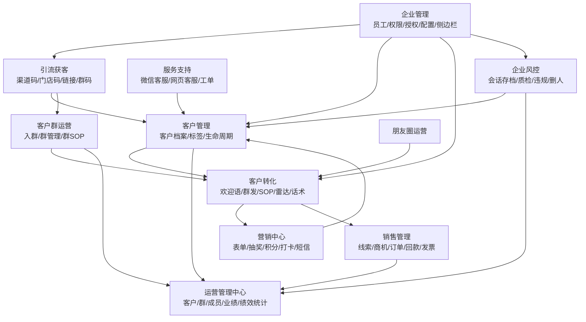

# 好客私域通业务模块分析

分析日期：2026-06-24  
依据资料：`screenshots/`、`采集截图与页面树/`、`scrm_page_inventory.json`、`scrm_manual_subpages_v2.json`、`scrm_manual_subpages_remaining.json`、`SCRM产品方案.md`

## 0. 结论

好客私域通是一套围绕企业微信的全链路 SCRM 系统，不只是“加好友/群发工具”。它把客户从渠道、门店、活动、链接、群聊等入口引入企业微信，再通过标签、欢迎语、SOP、群运营、朋友圈、营销活动、销售跟进、服务工单、会话风控和数据看板，把客户资产沉淀在企业名下。

从业务本质看，系统解决四件事：

1. 获客归因：知道客户从哪里来、由谁接待、进入哪个群、是否转化。
2. 客户经营：用标签、素材、话术、SOP、群发、朋友圈持续触达客户。
3. 交易推进：把客户转为线索、商机、订单、回款、发票。
4. 组织管控：用员工权限、绩效、会话存档、质检、操作日志防止客户资产流失。

典型业务闭环：

`渠道/门店/活动投放 -> 客户扫码/链接添加企微或入群 -> 自动分配员工 -> 打标签/备注/欢迎语 -> SOP/群运营/朋友圈/营销活动触达 -> 线索/商机/订单/回款 -> 数据统计/绩效/风控复盘`

## 1. 数据概况

### 1.1 数据概况

用途：给管理者和运营负责人看全局健康度，包括客户总数、今日新增、今日流失、群总数、今日入群、今日退群、新增/流失趋势、事件提醒、企业套餐信息。

怎么操作：进入首页后按时间范围、员工筛选查看指标；可进入客户、客户群、事件提醒等详情。页面中出现“查看客户”“查看客户群”“事件提醒”“查看更多”等入口。

角色与场景：老板、私域负责人、运营主管每天看盘；销售主管查看客户增长与流失；管理员关注版本到期、专属客服、会话存档配置提醒。

关联关系：汇总引流获客、客户管理、客户群运营、企业风控、运营管理中心的数据。它不是业务执行页，而是“异常发现和经营复盘”的入口。

## 2. 引流获客

模块定位：把公域、门店、广告、线下物料、员工推广、社群活动里的用户导入企业微信客户或客户群，并记录来源、接待员工、标签、欢迎语和后续统计。

### 2.1 渠道活码

用途：为不同渠道、活动、商品、海报、投放位生成企业微信二维码，客户扫码后随机或按规则分配给客服/员工，自动打来源标签、发送欢迎语，并统计每个码的新增和流失。

怎么操作：新建活码或批量创建活码；填写二维码名称、分组、客服人员、在线方式、员工添加上限、备用员工、客户标签、客户备注、客户描述；设置渠道欢迎语/默认欢迎语/不发送；可设置分时段欢迎语、欢迎语屏蔽、活码类型；创建后下载二维码、查看数据统计、编辑或分组。

角色与场景：市场投放、运营、门店负责人、社群运营使用。适用于广告落地页、线下海报、商品包装、公众号菜单、活动页、门店收银台。

关联关系：进入客户管理形成客户档案和来源标签；触发好友欢迎语；进入客户统计、成员统计、渠道数据统计；可与素材库、表单、抽奖、小程序附件关联。

### 2.2 门店活码

用途：按门店配置二维码，把到店客户导入对应门店或店主/导购名下，形成门店归因。

怎么操作：按门店名称、城市、门店店主、开启状态筛选；添加门店、设置门店信息；列表展示门店名称、地址、店主、状态，并支持修改/删除。

角色与场景：线下门店运营、区域经理、店长使用。适用于收银台码、导购名片码、店铺海报码。

关联关系：与客户来源、门店业绩、导购绩效、门店客户群、客户迁移相关。对线下门店私域来说，这是最核心的归因入口之一。

### 2.3 锁客二维码

用途：让客户多次扫码时仍优先回到首次添加/已添加的员工，减少客户被重复分配、被其他员工“抢客”或资产归属混乱。

怎么操作：新建规则；配置规则名称、客服人员、员工添加上限、备用员工；设置欢迎语、自动通过好友、开启时间。页面说明显示：客户之前添加过所选客服人员时，会直接分配已添加员工；多次扫码由第一次扫码添加的员工接待。

角色与场景：销售主管、门店管理、渠道运营使用。适合高客单、导购强关系、区域保护、门店归属明确的业务。

关联关系：与员工客户关系、客户迁移、销售业绩归属、流失提醒强相关。

### 2.4 千人千面码

用途：根据客户身份、来源或规则展示不同接待路径，实现同一个入口对不同客户分配不同员工、内容或群聊。

怎么操作：新建规则，配置规则内容和状态；页面提供分享入口。当前采集只看到列表和规则入口，规则细节需复核。

角色与场景：精细化运营、会员运营使用。适合新老客差异化接待、不同城市/门店/标签人群分流。

关联关系：依赖客户标签、生命周期、门店归因、欢迎语和渠道统计。

### 2.5 自助推广码

用途：给员工、推广成员或地推客户生成专属推广海报/二维码，让他们自行分享获客，并统计每个人带来的客户。

怎么操作：新建推广码；选择推广码类型（添加成员或加入客户群）、活动名称、使用成员、地推客户、省市区、任务说明、推广文案、截止日期；系统为成员生成专属渠道和海报，成员领取后推广。

角色与场景：市场运营、地推负责人、销售主管、门店导购使用。适合员工拉新 PK、线下地推、达人分销、区域推广。

关联关系：与拉新排行榜、绩效管理、渠道活码、客户标签、客户统计关联。

### 2.6 加客服自动拉群

用途：客户先添加客服，再由客服或系统引导客户进入指定群，适合既要沉淀好友关系又要导入社群的场景。

怎么操作：新建拉群；配置使用成员、备用成员、标签、拉群方式、群聊、二维码；可分组管理、批量分组。

角色与场景：社群运营、客服主管、活动运营使用。适合课程群、福利群、门店会员群、活动群。

关联关系：连接渠道获客、客户群管理、入群欢迎语、群 SOP、客户标签。

### 2.7 无客服无限拉群

用途：不经过添加客服好友，客户扫码直接进群，降低入群阻力，提高活动群入群率。

怎么操作：新建拉群；上传或配置活码，客户扫码进入群聊。采集页面说明强调“无需创建群即可开始拉群任务”“客户扫码不用添加企业成员即可入群”。

角色与场景：社群运营、活动运营使用。适合低门槛福利群、短期活动群、直播通知群。

关联关系：与群活码、群管理、群统计相关；缺点是客户未必沉淀为企微好友，后续一对一触达弱。

### 2.8 多群自选引流

用途：让客户扫码后在多个群之间自选加入，适合多个主题、地区、门店、课程或活动群并行承接。

怎么操作：新建多群引流；配置名称、关联自定义群名称、创建人。当前采集只看到列表字段，创建细节需复核。

角色与场景：社群运营使用。适合城市群、门店群、兴趣群、课程分班群。

关联关系：与客户群标签、群统计、群日历、群 SOP 关联。

### 2.9 标签邀请入群

用途：按客户标签筛选一批客户，向他们发送入群邀请，实现分层社群运营。

怎么操作：创建任务，设置任务名称、群发账号、客户筛选条件、入群引导语、群聊、过滤规则；系统通知成员确认发送，客户扫码入群；后台查看发送和入群数据。

角色与场景：会员运营、社群运营使用。适合把高意向客户、复购客户、某门店客户拉入不同运营群。

关联关系：依赖客户标签；结果沉淀到客户群管理、客户群统计。

### 2.10 批量加好友

用途：把手机号等外部客户名单导入系统，再分配员工批量添加企微好友。

怎么操作：导入客户；按待分配、待添加、待通过、已添加筛选；查看电话号码、客户备注名、导入时间、客户来源、添加状态、分配员工、分配次数；可提醒、删除。

角色与场景：电商客服、销售团队、运营人员使用。适合历史会员、表单线索、线下名单、活动报名名单导入企微。

关联关系：与线索公海、线索客户、客户管理、员工绩效相关。

### 2.11 加入群聊活码

用途：为客户群生成长期可用的加群码，避免单个群二维码过期或人数满员后失效。

怎么操作：新建加群活码；选择创建类型（手动上传/自动创建）、群名称、群序号、备注、关联群聊；列表可查看群名称、使用信息、群序号、关联群、创建类型、二维码并下载。

角色与场景：社群运营、活动运营使用。适合线下物料、海报、公众号菜单里的长期群入口。

关联关系：与客户群管理、群统计、群欢迎语相关。

### 2.12 获客链接

用途：用链接承接广告、短信、网页、海报、小程序等非二维码场景的流量，客户点击后添加客服。

怎么操作：填写基础信息，设置链接名称、客服人员、在线时间、员工添加上限、备用员工、标签；设置欢迎语；开启自动通过好友；查看链接在不同日期和员工维度的新增/流失数据。

角色与场景：市场投放、网页运营、短信运营、电商运营使用。适合落地页、短信、公众号文章、朋友圈、礼品包装。

关联关系：与渠道统计、欢迎语、客户标签、素材/表单/抽奖活动关联。

## 3. 客户管理

模块定位：把不同来源进入的客户沉淀为企业客户资产，并提供迁移、标签、生命周期、黑名单、字段配置等基础能力。

### 3.1 客户管理

用途：统一管理企微外部联系人和私域客户画像。当前采集页主要是功能介绍，说明该功能需进入使用后查看客户详情。

怎么操作：查看客户列表和客户详情；按员工、标签、来源、生命周期等筛选；对客户打标签、修改资料、记录动态、进入侧边栏或跟进。

角色与场景：导购、客服、销售、运营、主管使用。日常查看客户画像、跟进记录和客户归属。

关联关系：被所有模块引用，是渠道、群、销售、服务、风控、统计的中心对象。

### 3.2 客户迁移

用途：员工离职、调岗、门店调整或客户重新分配时，把客户从一个成员迁移到另一个成员，避免客户资产丢失。

怎么操作：筛选客户，执行分配客户；查看分配记录；同步客户状态。页面提供分配客户、分配记录、同步入口。

角色与场景：管理员、销售主管、门店经理使用。适合离职交接、区域调整、客户重分配。

关联关系：影响客户归属、销售绩效、流失提醒、员工统计。

### 3.3 流失提醒

用途：监测客户删除员工或关系流失，并通知管理员处理。

怎么操作：配置流失提醒通知管理员；列表按客户、成员、时间查看流失记录。

角色与场景：运营主管、销售主管使用。适合发现服务问题、员工私单风险、客户关系异常。

关联关系：与数据概况事件提醒、客户统计、企业风控、员工绩效相关。

### 3.4 黑名单

用途：把恶意客户、薅羊毛客户、违规客户加入黑名单，限制其参与活动或访问权益。

怎么操作：批量导入或从多个入口拉黑；查看拉黑时间、原因、操作人；配置禁止参与的活动规则；可移除。

角色与场景：客服主管、活动运营、风控人员使用。适合抽奖、红包、优惠券、裂变活动前置风控。

关联关系：与营销中心、客户群运营、电商优惠券、服务工单关联。

### 3.5 客户标签

用途：维护客户分层和运营条件，包括企业微信标签同步、本地标签组、标签新增。

怎么操作：添加标签组；同步企微标签；在客户详情、渠道码、自动打标签、群发筛选中使用。

角色与场景：运营、销售主管使用。用于人群筛选、自动化触达、客户分层。

关联关系：被群发、SOP、标签邀请入群、千人千面码、数据统计广泛依赖。

### 3.6 生命周期

用途：定义客户所处阶段，比如新客、跟进中、成交、复购、沉默、流失等。

怎么操作：进入周期设置，配置阶段和流转规则；客户按行为、时间或人工操作进入不同阶段。

角色与场景：私域运营、销售主管使用。用于不同阶段采取不同 SOP 和跟进策略。

关联关系：与客户 SOP、阶段管理、行为 SOP、客户统计相关。

### 3.7 自定义信息

用途：配置客户画像字段在侧边栏和后台展示的内容。

怎么操作：修改基本信息展示项；添加自定义字段，设置字段名称、字段类型（文本/选择等）；预览侧边栏展示效果。

角色与场景：管理员、业务负责人使用。适合补充门店、尺码、偏好、预算、生日、会员等级等业务字段。

关联关系：影响客户画像、销售跟进、侧边栏、客户筛选。

### 3.8 预设属性

用途：管理客户基础属性的可选值，如来源、年龄、描述等，保证客户资料结构化。

怎么操作：通过属性下拉入口配置预设信息。

角色与场景：管理员、运营使用。适合统一字段口径，减少员工手填造成的数据混乱。

关联关系：与自定义信息、客户管理、客户筛选、统计口径相关。

## 4. 客户转化

模块定位：把“已加好友的客户”变成可运营、可跟进、可成交的对象，核心是触达、提醒、内容、SOP 和行为识别。

### 4.1 客户群发

用途：管理员创建面向客户的一对一群发任务，由员工在企业微信确认发送。

怎么操作：新建群发，选择发送成员、客户范围、消息内容和发送时间；员工确认后发送；后续查看发送结果。

角色与场景：运营创建，导购/客服确认发送。适合促销通知、新品上新、会员召回、活动提醒。

关联关系：依赖客户标签、素材库、员工确认；数据进入群发统计。

### 4.2 好友欢迎语

用途：客户添加员工后自动发送欢迎语，承接新客第一触点。

怎么操作：新建欢迎语；设置适用成员、触发条件、消息内容，可包含文字、图片、链接、小程序、表单、抽奖活动等。

角色与场景：运营、客服主管使用。适合新客介绍、福利引导、入群引导、表单收集。

关联关系：被渠道活码、锁客二维码、获客链接等入口调用。

### 4.3 客户 SOP

用途：按客户阶段、时间或条件自动生成跟进动作，保证员工按标准流程运营客户。

怎么操作：创建规则，配置触发人群、执行节点、内容任务、提醒员工；列表可筛选和重置。

角色与场景：运营主管、销售主管使用。适合新客 1/3/7 天培育、沉默召回、成交后复购。

关联关系：依赖生命周期、客户标签、待办提醒、素材库、话术库。

### 4.4 行为 SOP

用途：客户发生特定行为后触发运营动作，比如打开链接、提交表单、点击雷达、入群、购买等。

怎么操作：创建规则，设置行为条件和后续提醒/标签/触达动作。

角色与场景：精细化运营、销售主管使用。适合高意向客户即时跟进。

关联关系：与互动雷达、自动打标签、客户标签、待办提醒关联。

### 4.5 跟进计划

用途：把客户跟进拆成计划任务，避免员工漏跟进。

怎么操作：创建规则，配置筛选条件、跟进时间、执行成员、提醒内容。

角色与场景：销售主管、导购主管使用。适合 B2B 线索、门店试用、咨询未成交客户。

关联关系：与待办提醒、客户阶段、商机管理关联。

### 4.6 运营计划

用途：以运营活动或周期为单位组织触达计划，统一排期和执行。

怎么操作：创建运营计划/新建运营计划，配置计划内容、目标人群、执行节奏。

角色与场景：私域运营负责人使用。适合月度会员运营、新品预热、节日营销。

关联关系：连接客户群发、群日历、素材库、营销中心。

### 4.7 阶段管理

用途：管理客户转化阶段或销售阶段，用于统一流程状态。

怎么操作：进入设置，配置阶段名称、顺序、状态。

角色与场景：销售主管、运营主管使用。适合客户从新客到成交、复购、流失的阶段管理。

关联关系：与生命周期、客户 SOP、商机管理、统计看板相关。

### 4.8 待办提醒

用途：自动或手动生成员工待办，推动员工及时联系客户。

怎么操作：创建规则，配置触发条件、提醒对象、提醒内容。

角色与场景：销售、导购、客服主管使用。适合未回复、未跟进、客户行为触发后的跟进提醒。

关联关系：与客户 SOP、行为 SOP、跟进计划、风控提醒关联。

### 4.9 企业话术库

用途：统一员工对外沟通话术，减少表达不一致和新员工培训成本。

怎么操作：新建话术、导入话术、批量删除；配置话术分类、内容，供员工侧边栏调用。

角色与场景：运营、客服主管、培训负责人使用。适合售前问答、异议处理、活动说明、售后安抚。

关联关系：与聊天侧边栏、商学院、单聊质检关联。

### 4.10 素材库

用途：管理图片、文章、链接、小程序、文件等内容素材，供欢迎语、群发、侧边栏、朋友圈使用。

怎么操作：新建素材，配置素材类型、名称、内容和适用范围。

角色与场景：内容运营、销售支持、客服主管使用。

关联关系：与欢迎语、群发、互动雷达、朋友圈、授权公众号文章同步相关。

### 4.11 互动雷达

用途：创建可追踪的链接/素材，识别客户是否打开、浏览、感兴趣。

怎么操作：新建雷达链接；配置链接、标题、追踪规则、提醒或标签动作。

角色与场景：销售、运营使用。适合判断客户意向，如报价单、案例、活动页是否被打开。

关联关系：触发行为 SOP、自动打标签、待办提醒。

### 4.12 自动打标签

用途：根据客户来源、行为或条件自动打标签。

怎么操作：添加规则，设置触发条件和目标标签。

角色与场景：运营使用。适合扫码来源标签、活动参与标签、内容兴趣标签、购买意向标签。

关联关系：依赖客户行为数据，服务于群发筛选、SOP、人群分层。

### 4.13 预打标签

用途：在客户正式进入或触发动作前预先设置标签规则，便于后续自动归类。

怎么操作：进入预打标签配置，设置预打标签规则。

角色与场景：运营使用。适合活动开始前预置人群标签。

关联关系：与渠道活码、表单、获客链接、客户标签相关。

## 5. 客户群运营

模块定位：把客户群作为独立运营资产管理，覆盖群档案、入群欢迎、群发、群 SOP、群日历、群提醒和群标签。

### 5.1 客户群管理

用途：查看和管理企业微信客户群，包括群主、群成员、群标签、群状态等。

怎么操作：筛选群，导出 Excel，批量打群标签；可设置群 SOP。

角色与场景：社群运营、群主主管使用。适合管理门店群、活动群、会员群。

关联关系：连接入群活码、群欢迎语、群 SOP、群统计。

### 5.2 入群欢迎语

用途：客户入群后自动发送欢迎内容，降低群主重复劳动。

怎么操作：新建入群欢迎语；配置适用群、欢迎内容、素材。

角色与场景：社群运营使用。适合群规说明、福利领取、客服引导。

关联关系：与素材库、群标签、群管理关联。

### 5.3 客户群群发

用途：向多个客户群批量发送群消息。

怎么操作：新建群发；选择群、群主、发送内容和时间；通常需群主确认。

角色与场景：社群运营创建，群主执行。适合活动通知、直播提醒、新品福利。

关联关系：数据进入群发统计；内容来自素材库。

### 5.4 群 SOP

用途：按群阶段或时间自动提醒群主执行运营动作。

怎么操作：立即使用后创建群 SOP 或从客户群管理里设置群 SOP。

角色与场景：社群运营负责人使用。适合新群冷启动、活动群周期运营、长期会员群维护。

关联关系：与群日历、群提醒、客户群统计关联。

### 5.5 群日历

用途：用日历视图安排群运营动作。

怎么操作：进入功能后按日期安排内容和提醒。

角色与场景：社群运营使用。适合固定栏目、活动排期、节日营销。

关联关系：与群 SOP、客户群群发、素材库关联。

### 5.6 客户群提醒

用途：监控群内关键事件并提醒群主或管理员。

怎么操作：开始使用后配置提醒规则。

角色与场景：社群运营、客服主管使用。适合群内长时间未回复、关键词、退群、活跃异常。

关联关系：与群聊质检、违规提醒、群统计关联。

### 5.7 客户群标签

用途：给群打标签，按群类型、门店、活动、价值分层管理。

怎么操作：添加标签组/新建标签组；对群批量打标签。

角色与场景：社群运营使用。

关联关系：服务于群发筛选、群 SOP、群统计。

## 6. 销售管理

模块定位：承接客户运营后的交易转化，把客户推进为线索、商机、订单、回款和发票。

### 6.1 线索公海

用途：集中存放未分配或可领取的销售线索。

怎么操作：新增线索；高级搜索；导出 Excel；页面设置；批量分配。

角色与场景：销售主管、销售、运营使用。适合表单线索、活动线索、批量导入名单。

关联关系：线索分配后进入线索客户；可来自批量加好友、自定义表单、获客链接。

### 6.2 线索客户

用途：管理已分配到销售/员工名下的线索客户。

怎么操作：新增客户；按员工筛选；高级搜索；导出；填写客户信息和跟进资料。

角色与场景：销售、导购、销售主管使用。

关联关系：可转商机、订单；关联客户管理和跟进计划。

### 6.3 商机管理

用途：管理有成交可能的机会，包括负责人、金额、阶段、预计成交等。

怎么操作：新增商机；按员工筛选；更新商机阶段和信息。

角色与场景：销售和销售主管使用。适合高客单、B2B、加盟、代理、定制服务。

关联关系：来源于线索客户，后续转订单、回款、业绩看板。

### 6.4 订单管理

用途：记录和管理销售订单。

怎么操作：新建订单；订单设置；按员工筛选；查看订单状态和明细。

角色与场景：销售、财务、销售主管使用。

关联关系：订单关联客户、商机、回款、发票和业绩统计。

### 6.5 回款管理

用途：管理订单收款和回款审核。

怎么操作：新建回款单；回款设置；筛选员工；导出 Excel。

角色与场景：销售、财务、销售主管使用。

关联关系：影响业绩看板、绩效、订单状态。

### 6.6 发票管理

用途：管理客户开票申请和发票流程。

怎么操作：新增开票申请；发票设置；按员工筛选；查看开票状态。

角色与场景：财务、销售使用。

关联关系：关联订单、回款、客户和财务流程。

## 7. 营销中心

模块定位：提供活动、表单、抽奖、打卡、积分、短信等增长和促活工具。部分页面采集存在跳转异常：多维裂变、群活动裂变、红包福利页面摘要疑似复用了发票管理内容，需要复核后再做细化。

### 7.1 多维裂变

用途：通过邀请好友、分享海报、阶梯奖励等方式拉新。当前页面证据不足，需复核。

怎么操作：通常应创建裂变活动、配置参与人群、奖励规则、海报、渠道和统计。

角色与场景：增长运营使用。适合老带新、会员拉新、社群裂变。

关联关系：与自助推广码、拉新排行榜、积分权益、客户标签关联。

### 7.2 群活动裂变

用途：围绕客户群做裂变拉新。当前页面证据不足，需复核。

怎么操作：通常应选择客户群、配置邀请规则、奖励和入群路径。

角色与场景：社群运营使用。

关联关系：与客户群管理、加入群聊活码、群统计关联。

### 7.3 红包福利

用途：通过红包激励客户参与活动或提升社群活跃。当前页面证据不足，需复核。

怎么操作：通常应配置红包金额、领取条件、发放对象、活动时间。

角色与场景：社群运营、活动运营使用。

关联关系：需要公众号/服务号 openID、黑名单、活动统计支持。

### 7.4 群打卡

用途：在客户群内发起连续打卡活动，提升活跃和留存。

怎么操作：新增打卡活动；配置活动名称、群聊、打卡周期、规则、奖励。

角色与场景：社群运营、课程运营使用。适合学习打卡、健康打卡、会员任务。

关联关系：与授权公众号、客户标签、群管理、积分权益关联。

### 7.5 短信运营中心

用途：通过短信触达未加企微或需要召回的客户。

怎么操作：创建短信群发；管理黑名单列表；选择客户、编辑短信内容、发送并查看结果。

角色与场景：运营、客服主管使用。适合会员召回、活动通知、订单提醒。

关联关系：与获客链接、客户手机号、黑名单、数据统计关联。

### 7.6 自定义表单

用途：创建报名、调研、留资、售后登记等表单。

怎么操作：开始使用后创建表单，配置字段、提交后动作和数据查看。

角色与场景：运营、销售、客服使用。适合活动报名、客户信息补全、售后需求收集。

关联关系：可嵌入欢迎语、群发、获客链接、素材库；提交后进入线索或打标签。

### 7.7 拉新排行榜

用途：按员工、客户或推广者统计拉新排名，驱动推广竞赛。

怎么操作：创建排行榜活动；配置排名对象、活动时间、奖励规则；查看榜单。

角色与场景：增长运营、销售主管、门店经理使用。

关联关系：与自助推广码、渠道活码、绩效管理关联。

### 7.8 积分权益

用途：配置客户积分规则和权益，用积分驱动互动、复购和拉新。

怎么操作：添加规则；配置得分动作、消耗权益、适用范围。

角色与场景：会员运营使用。

关联关系：与打卡、抽奖、优惠券、电商平台、客户标签关联。

### 7.9 大转盘抽奖

用途：用抽奖活动提升转化和互动。

怎么操作：创建抽奖活动；配置奖品、中奖概率、参与条件、活动时间。

角色与场景：活动运营、社群运营使用。

关联关系：与黑名单、优惠券、客户标签、公众号授权、活动统计关联。

## 8. 电商平台

模块定位：连接电商客户、优惠券、互动和平台配置，让线上交易数据与企微私域客户打通。

### 8.1 互动管理

用途：创建电商互动任务或活动。

怎么操作：新建互动；配置活动名称、规则和关联客户。采集有新建互动入口，细节需结合页面复核。

角色与场景：电商运营、会员运营使用。

关联关系：与电商客户、优惠券、客户标签、行为 SOP 关联。

### 8.2 优惠券管理

用途：管理优惠券创建、发放和核销。

怎么操作：新建优惠券；配置券类型、面额、有效期、适用范围和领取规则。

角色与场景：电商运营、会员运营使用。

关联关系：可作为抽奖奖品、积分权益、群发福利；核销数据进入客户画像。

### 8.3 电商客户管理

用途：管理电商平台客户，并与企微客户建立映射。

怎么操作：当前采集页面疑似未完整跳转，按钮显示异常为新建优惠券，需复核。

角色与场景：电商运营、客服使用。

关联关系：核心是手机号、订单、会员 ID 与企微 external_userid 的统一。

### 8.4 平台配置

用途：配置电商平台接入、授权和数据同步。

怎么操作：进入平台配置并按引导授权或配置接口。

角色与场景：管理员、技术/运营配置人员使用。

关联关系：是电商客户、优惠券、互动数据进入 SCRM 的基础。

## 9. 商学院

模块定位：培训员工、导购、客服，提高销售与服务标准化能力。

### 9.1 课程管理

用途：创建培训课程和学习资料。

怎么操作：新增课程；配置课程名称、内容、适用员工、课件。

角色与场景：培训负责人、运营主管使用。

关联关系：与学习任务、考试管理、员工管理关联。

### 9.2 考试管理

用途：组织考试，检验员工学习效果。

怎么操作：新增考试；配置考试名称、题目、考试对象、时间和分数规则。

角色与场景：培训负责人、管理者使用。

关联关系：与课程、学习任务、员工绩效可关联。

### 9.3 学习任务

用途：把课程或考试分配给指定员工，跟踪完成情况。

怎么操作：新建学习任务；选择课程/考试、学习人员、截止时间。

角色与场景：培训负责人、主管使用。

关联关系：与员工管理、绩效管理关联。

## 10. 运营管理中心

模块定位：统一看经营指标、成员表现、群发效果、绩效和数据订阅。

### 10.1 客户统计

用途：看客户新增、流失、净增、来源、员工维度数据。

怎么操作：按时间、员工筛选并重置条件。

角色与场景：运营负责人、销售主管使用。

关联关系：来源于引流获客和客户管理。

### 10.2 客户群统计

用途：看群新增、入群、退群、群成员变化等。

怎么操作：按时间或群维度筛选。

角色与场景：社群运营负责人使用。

关联关系：来源于客户群运营、加群活码。

### 10.3 成员统计

用途：看员工添加客户、流失客户、跟进表现。

怎么操作：按员工和时间筛选。

角色与场景：销售主管、门店经理、客服主管使用。

关联关系：与绩效管理、客户迁移、流失提醒关联。

### 10.4 群发统计

用途：统计客户群发和客户群群发的发送效果。

怎么操作：筛选时间和任务，导出 Excel。

角色与场景：运营负责人使用。

关联关系：来源于客户群发、客户群群发。

### 10.5 业绩看板

用途：查看订单、回款、销售业绩等经营结果。

怎么操作：选择模板查看不同口径的业绩报表。

角色与场景：老板、销售主管、财务使用。

关联关系：来源于销售管理。

### 10.6 绩效看板

用途：查看员工绩效结果。

怎么操作：进入看板查看指标排行和完成情况。

角色与场景：管理者、主管使用。

关联关系：依赖绩效管理配置、成员统计、销售数据。

### 10.7 绩效管理

用途：配置绩效指标、考核对象和周期。

怎么操作：按员工/周期筛选并维护绩效数据。

角色与场景：主管、HR、运营负责人使用。

关联关系：与成员统计、业绩看板、拉新排行榜、销售管理关联。

### 10.8 数据订阅

用途：把经营数据定期推送给指定人员。

怎么操作：配置订阅对象、数据范围、发送频率。采集页细节较少，需复核。

角色与场景：老板、业务负责人、主管使用。

关联关系：来自各统计报表。

### 10.9 一客一码统计

用途：统计“一客一码”带来的客户邀请或传播效果。

怎么操作：按员工筛选查看数据。

角色与场景：增长运营、导购主管使用。

关联关系：与聊天侧边栏的一客一码配置、个人名片、自助推广码相关。

## 11. 朋友圈运营

模块定位：统一管理员工或企业朋友圈内容，提升品牌曝光和客户触达。

### 11.1 好客朋友圈

用途：在好客私域通内发布和管理朋友圈内容。

怎么操作：发布朋友圈；按条件筛选和重置；查看记录。

角色与场景：内容运营、销售主管使用。适合新品、活动、案例、门店内容统一分发。

关联关系：与素材库、朋友圈质检、员工执行相关。

### 11.2 企微朋友圈

用途：同步和发布企业微信朋友圈。

怎么操作：发布企业朋友圈；同步朋友圈文件；同步至好客私域通朋友圈；同步企业朋友圈记录。

角色与场景：运营、品牌、销售主管使用。

关联关系：与企业微信官方朋友圈能力、素材库、朋友圈质检关联。

## 12. 服务支持

模块定位：处理客户咨询和售后问题，覆盖微信客服、网页客服和工单。

### 12.1 微信客服

用途：接入企业微信的微信客服能力，用于公众号、小程序、视频号等场景的客户咨询。

怎么操作：按教程在企业微信开通微信客服，配置客服工具栏、创建客服账号、设置接待；在系统中进入下一步完成接入。

角色与场景：客服主管、管理员使用。

关联关系：与客户管理、工单系统、聊天侧边栏关联。

### 12.2 网页客服

用途：在网页或活动页嵌入客服入口，让访客通过网页添加客服或咨询。

怎么操作：新建网页客服；配置名称、客服类型、添加渠道或自定义二维码、选择活动名称。

角色与场景：网站运营、客服主管、活动运营使用。

关联关系：与获客链接、渠道活码、活动页、客户管理关联。

### 12.3 工单系统

用途：把客户问题、售后请求、内部协作事项流程化处理。

怎么操作：新建工单；填写工单标题、流程、关联客户/群、订单号、待处理人、问题内容；列表按标题、字段、创建人、待处理人、时间筛选，可导出。

角色与场景：客服、售后、运营、财务、销售协作使用。

关联关系：关联客户、客户群、订单、员工和服务时长统计。

## 13. 企业风控

模块定位：基于会话存档和规则监控员工沟通、客户删除、违规词、质检和内部沟通，保护客户资产和服务质量。

### 13.1 消息存档

用途：开通企业微信会话内容存档，是单聊质检、群聊质检、违规提醒、词频分析等能力的基础。

怎么操作：在企业微信管理工具中开启会话内容存档，配置开启范围、可信 IP、消息加密公钥，然后在系统提交配置。

角色与场景：管理员、IT、风控负责人使用。

关联关系：是企业风控模块的底座，也支撑服务复盘和飞单防控。

### 13.2 违规提醒

用途：监控敏感词和违规行为，避免飞单、私单、辱骂客户、引导私域外交易等风险。

怎么操作：设置关键词、提醒通知管理员、通知频率；触发后管理员在企业微信收到提醒。

角色与场景：风控、客服主管、销售主管使用。

关联关系：依赖消息存档；关联单聊/群聊质检、操作日志。

### 13.3 单聊质检

用途：检查员工与客户一对一沟通质量。

怎么操作：创建单聊质检规则；设置质检范围和规则；触发后提醒员工或质检人员。

角色与场景：客服主管、销售主管、质检使用。

关联关系：依赖消息存档，与话术库、违规提醒、员工绩效关联。

### 13.4 群聊质检

用途：检查客户群内服务质量，如是否及时回复、是否触发规则。

怎么操作：创建群聊质检规则；设置质检群聊和规则；触发后提醒群主或质检人员。

角色与场景：社群运营、客服主管使用。

关联关系：依赖消息存档，与客户群提醒、群统计关联。

### 13.5 朋友圈质检

用途：检查员工或企业朋友圈内容是否合规。

怎么操作：立即使用后配置质检规则。当前采集页面与群聊质检说明相似，细节需复核。

角色与场景：品牌、合规、运营主管使用。

关联关系：与朋友圈运营、违规提醒关联。

### 13.6 删人提醒

用途：提醒管理员客户或员工关系被删除，防止客户资产流失。

怎么操作：立即使用后配置提醒规则。当前采集页面说明疑似复用了群聊质检文案，需复核。

角色与场景：销售主管、风控、运营负责人使用。

关联关系：与客户流失提醒、客户迁移、成员统计关联。

### 13.7 词频分析

用途：分析单聊/群聊中高频词，发现客户需求、员工话术问题或风险词。

怎么操作：立即使用后查看词频报表。当前页面细节需复核。

角色与场景：运营分析、客服主管、产品/市场使用。

关联关系：依赖消息存档；可反哺话术库、素材库、产品需求。

### 13.8 内部沟通

用途：管理或查看成员内部沟通记录，用于协作留痕和风险审计。

怎么操作：立即使用后配置范围。当前采集页面细节需复核。

角色与场景：管理员、风控、管理层使用。

关联关系：依赖消息存档和权限管理。

## 14. 企业管理

模块定位：配置组织、权限、授权、应用、侧边栏、企业信息和操作审计，是所有业务模块运行的后台底座。

### 14.1 员工管理

用途：管理员工账号、部门、角色、坐席权限、授权状态，并与企业微信通讯录同步。

怎么操作：查看成员列表、部门信息、手机号、坐席权限、授权状态；添加成员；员工部门修改需前往企业微信。

角色与场景：管理员、HR、IT 使用。

关联关系：员工是活码接待、客户归属、群主、销售、客服、绩效的基础对象。

### 14.2 权限管理

用途：配置角色和成员权限，控制不同员工能看/能操作哪些功能和数据。

怎么操作：查看超级管理员、管理员、部门管理员、普通员工；添加自定义角色；更换角色；查看操作记录。

角色与场景：管理员使用。

关联关系：影响所有模块的数据可见范围和操作边界。

### 14.3 个人名片

用途：为员工配置对外名片，展示个人、企业、产品信息，并追踪客户访问行为。

怎么操作：设置名片内容、企业信息、产品信息、访客提醒；客户打开后记录访问数据。

角色与场景：销售、导购、客服、运营使用。

关联关系：与一客一码统计、互动雷达、素材库、客户画像关联。

### 14.4 企业信息

用途：维护企业基础资料、版本、到期日期、企业类型、认证状态、行业、规模、企业 ID。

怎么操作：查看企业信息，修改信息。

角色与场景：管理员、财务、IT 使用。

关联关系：影响系统授权、套餐、订单中心、配置管理。

### 14.5 操作日志

用途：记录管理员和员工在后台/侧边栏的关键操作，便于审计。

怎么操作：按类型、员工、时段、功能类型筛选；查看具体操作行为、操作员工、时间、IP。

角色与场景：管理员、风控、审计使用。

关联关系：与权限管理、企业风控、员工管理关联。

### 14.6 授权管理

用途：授权公众号/服务号，让素材库文章、群打卡、群红包等功能能获取公众号能力和 openID。

怎么操作：添加公众号；由公众号管理员扫码授权；更新数据查看微信开放平台绑定状态。

角色与场景：管理员、新媒体运营使用。

关联关系：影响素材库文章同步、群打卡、红包福利、公众号客户身份识别。

### 14.7 配置管理

用途：配置应用模式、企业登录地址、工作台主页、代理服务器、域名、通讯录同步等基础技术参数。

怎么操作：选择服务商代开发/自建模式；复制或保存地址；配置代理服务器、域名和通讯录同步。

角色与场景：管理员、IT、实施人员使用。

关联关系：是企业微信接入、侧边栏、通讯录同步、API 调用的基础。

### 14.8 聊天侧边栏

用途：在企业微信聊天窗口右侧提供快捷工具，如客户画像、快捷回复、素材、个人名片、一客一码等。

怎么操作：复制配置链接，按教程开通侧边栏；配置一客一码；员工在企业微信与客户聊天时打开侧边栏使用。

角色与场景：一线导购、客服、销售使用。它是后台能力落到员工日常工作的关键入口。

关联关系：调用客户画像、话术库、素材库、个人名片、一客一码、工单等能力。

### 14.9 订单中心

用途：管理企业购买的套餐、短信、互通账号等系统订单。

怎么操作：按付费类型、订单状态筛选；查看订单号、类型、订单内容、创建人、金额、交易状态。

角色与场景：管理员、财务使用。

关联关系：与企业套餐、短信运营、账号坐席、续费相关。

## 15. 全局业务关联图

## 16. 系统整体目标

系统整体是在做“企业微信私域客户资产经营”。它把分散在广告、门店、电商、活动、员工、社群里的客户统一接入企业微信，并通过企业可控的员工、权限、标签、SOP、数据、风控体系持续经营。

它能达到的目标：

1. 降低获客混乱：每个客户来源、接待员工、门店/渠道归因可追踪。
2. 提升转化效率：欢迎语、SOP、话术、素材、雷达、待办让员工少漏跟进。
3. 提升社群效率：群活码、群欢迎、群发、群日历、群 SOP 让群运营标准化。
4. 打通销售结果：从客户到线索、商机、订单、回款、发票形成交易闭环。
5. 提升管理可视化：客户、群、成员、群发、业绩、绩效可统计和订阅。
6. 保护客户资产：客户迁移、流失提醒、会话存档、违规提醒、质检、操作日志降低飞单和资产流失。
7. 支撑线下门店私域：门店活码、锁客、员工绩效、客户迁移、门店客户群能支撑导购拉新和门店归因。

## 17. 当前采集资料的限制

1. 多维裂变、群活动裂变、红包福利、电商客户管理等页面存在疑似跳转或采集复用异常，不能仅凭当前截图确认完整操作链路。
2. 部分“开始使用/立即使用”页面只有功能介绍，尚未进入真实配置页，例如黑名单、标签邀请入群、个人名片、群日历、群 SOP、数据订阅等。
3. 企业风控部分页面文案高度重复，可能是未开通会话存档前的介绍态，真实规则配置页需要在开通后复核。
4. 本文对角色、场景、关联关系采用“页面证据 + SCRM 业务常识”推断，已对证据不足处单独标注。
