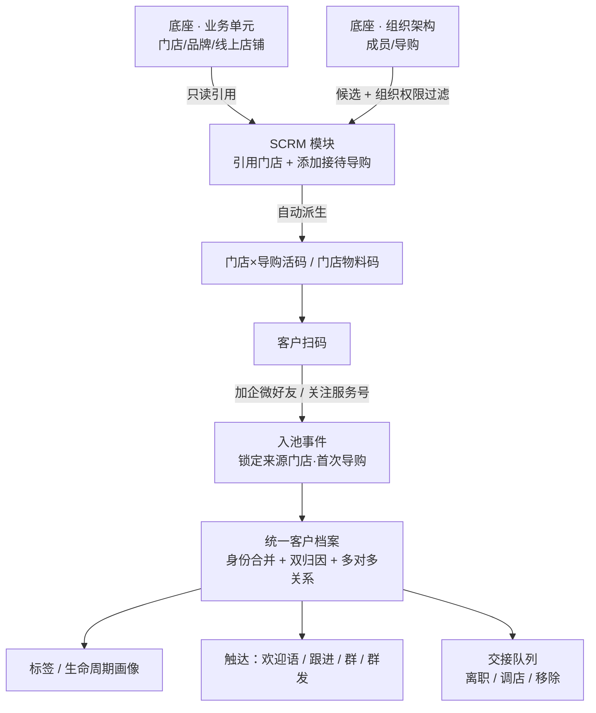
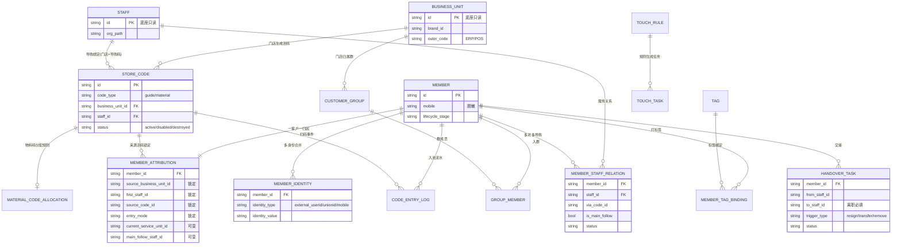
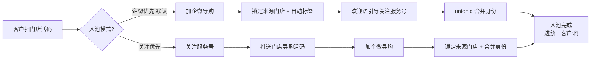
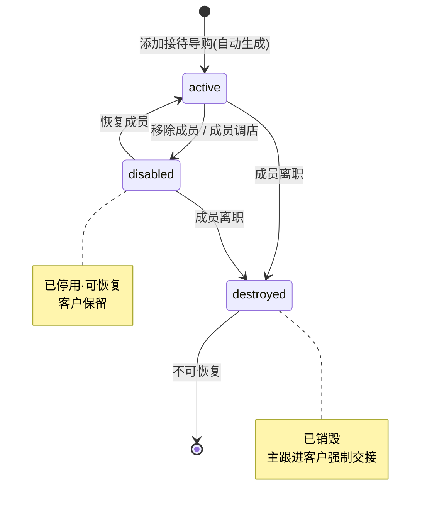
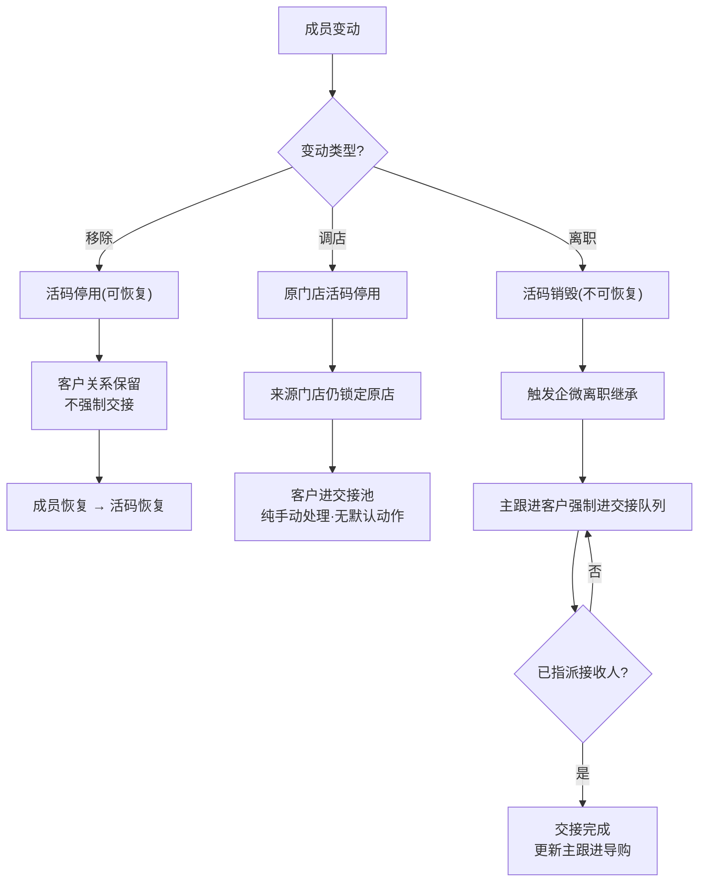

# 线下门店私域闭环 · 实现方案（PRD + 技术）

文档版本：v1.0
撰写日期：2026-06-11
适用范围：美梦 SCRM 本期「线下门店导购引流入池」迭代
关联文档：`SCRM产品方案.md`（整体产品蓝图）、`线下门店私域MVP点击原型.html`（点击原型）

---

## 1. 背景与目标

### 1.1 业务背景

公司为多品牌互联网电商企业，销售渠道分线上线下：线下通过直营门店与代理分销门店销售，线上通过新媒体电商与传统电商多店铺销售。企业微信已完成接入，服务号已具备。整体目标是用私域统一承接线上线下全部消费者，沉淀为可运营的客户资产。

本期不追求一次覆盖全渠道，而是**先打通线下门店这一条最具确定性的引流闭环**：让门店导购通过企业微信把到店及触达的客户引入统一私域客户池，系统能记录客户来源、门店归属、品牌归属、导购归属，能区分客户特征，并能通过企微官方链路触达客户。

### 1.2 本期目标

- 门店导购可凭「门店 × 导购」活码把客户引入私域，客户进入后**来源门店、首次导购被锁定**，形成不可篡改的归因。
- 系统统一客户身份（企微 external_userid + 服务号 unionid + 手机号），支持后续合并电商/门店会员。
- 客户具备分层标签与生命周期画像，可按门店、品牌、导购、来源维度筛选。
- 导购与管理者可通过欢迎语、跟进待办、客户群、群发等企微官方能力触达客户。
- 活码随成员变动自动维护（生成/停用/销毁），离职、调店触发规范的客户交接，杜绝客户资产因人员变动而流失。

### 1.3 成功衡量

- 入池转化：扫码到加企微/关注的完成率。
- 归因完整率：入池客户中来源门店、首次导购、品牌字段齐全的比例。
- 资产留存：成员离职/调店后客户被成功交接、未流失的比例。
- 触达覆盖：私域客户中被欢迎语/跟进/群运营触达过的比例。

---

## 2. 范围与边界

### 2.1 本期做（In Scope）

- 门店（业务单元）在 SCRM 模块的**只读引用**与私域配置叠加。
- 「门店 × 导购」活码自动生成与生命周期管理。
- 门店物料码（海报/收银台长期码）与动态导购分配。
- 两种入池模式：企微优先（默认）/ 关注优先，由系统参数与活码级开关控制。
- 统一客户池：身份合并、来源/服务双归因、多对多导购关系留痕。
- 客户标签体系与生命周期阶段。
- 触达：好友欢迎语、导购跟进待办、客户群、客户群发（走企微官方确认链路）。
- 成员变动驱动的活码维护与客户交接队列（离职强制交接、调店手动入池）。
- 管理后台与企微导购端两端。

### 2.2 本期不做（Out of Scope，后续阶段）

- 线上多店铺（新媒体电商、传统电商）的渠道活码、获客链接整合 → 线上整合阶段。
- 锁客二维码、千人千面码、自助推广码 → 反飞单与精细化阶段。
- 销售闭环（线索、商机、订单、回款、发票）→ 销售转化阶段。
- 营销玩法（裂变、抽奖、积分、打卡）与商学院 → 后置。
- 风控质检的完整建设（本期仅依赖企微会话存档做最低限度留痕）。
- 面向消费者的小程序（会员绑定/领券）→ 视会员打通需求另行评估。

### 2.3 关键设计前提

- **单体系统、共享数据库**：SCRM 与底座（业务单元、组织架构、权限、会话存档）在同库，SCRM 直接读取底座数据，**不做数据同步、不复制主数据**。
- **业务单元 = 边界，不拥有人**：业务单元只定义权限边界与基础属性（编码、品牌、区域、自定义属性），不直接挂人；人归属组织架构，通过组织权限管控。
- **归因由活码锁定，不由组织推导**：客户来源门店取决于其扫描的那张活码，不随导购后续跨店、调岗而变化。

---

## 3. 系统架构与职责划分

### 3.1 三层职责（互不重叠）

整个方案建立在三块互不重叠的职责之上，这是后续所有数据与功能设计的地基：

**① 底座 · 业务单元层（边界与主数据）**
维护门店、品牌、线上店铺等业务单元节点，提供内部编码、外部编码（ERP/POS）、外部 ID、父级业务单元、自定义属性。业务单元只表达"权限边界与基础定义"，是 SCRM 的**只读数据源**。SCRM 不新建、不编辑门店主数据。

**② 底座 · 组织架构与权限层（人与可见范围）**
维护成员（导购、店长、运营、管理员）及其组织归属。系统已支持两套正交权限：**组织权限**（控制"谁能操作"）与**业务单元权限**（控制"能看哪些业务单元的数据"）。人的可见范围、可操作对象都由这两套权限叠加决定，SCRM 不另建一套人员权限。

**③ SCRM 模块层（私域引用与业务状态）**
在业务模块内**引用**业务单元（门店），为门店**添加接待导购**（成员来自组织架构、候选受组织权限过滤），由此自动派生"门店 × 导购"活码；并叠加私域专属的业务状态：客户、归因、标签、客户群、触达任务、交接队列等。SCRM 持有的是"引用关系 + 私域业务状态"，而非主数据。

### 3.2 职责边界一句话总结

> 业务单元负责"边界是什么"，组织架构与权限负责"谁能进来、能看多少"，SCRM 模块负责"在边界内沉淀和经营客户"。三者通过**引用**而非**复制**连接。

### 3.3 数据流向

---

## 4. 数据模型

下列为 SCRM 模块**新增/持有**的表。门店主数据、组织架构、权限、会话存档均在底座，SCRM 通过外键引用（共享库直接关联），不重复建表。字段为关键字段示意，非完整 DDL。

### 4.0 实体关系总览（ER 图）

灰色节点为底座只读实体，其余为 SCRM 持有实体。核心是 `member`（客户）通过归因、关系、身份三张表向外辐射。

### 4.1 引用底座的外键（只读）

| 引用对象 | 来源（底座） | 在 SCRM 的用法 |
|---|---|---|
| `business_unit_id` | 业务单元表（类型=门店/品牌/线上店铺） | 活码、客户归因、客户群均挂此 ID；读取编码、品牌、区域、自定义属性 |
| `staff_id`（成员） | 组织架构成员表 | 接待导购、主跟进导购、群主等；候选与可见性受组织权限过滤 |
| `conversation_archive_*` | 会话存档 | 跟进留痕、风控最低限度引用 |

### 4.2 客户与身份

**`member`（统一客户主档）**
`id` · `nickname` · `avatar` · `mobile`（脱敏存储）· `lifecycle_stage`（新客/活跃/沉默/复购/流失/召回）· `first_brand_id` · `created_at`

**`member_identity`（身份映射，一客户多身份）**
`id` · `member_id` · `identity_type`（external_userid / unionid / openid / mobile / ecommerce_member / store_member）· `identity_value` · `merged_at` · `is_primary`
> 合并锚点：已加企微用 `external_userid`，跨服务号用 `unionid`，未加企微/跨电商门店用 `mobile`。同一自然人多身份合并到同一 `member_id`。

**`member_profile_field`（自定义画像字段）**
`member_id` · `field_key` · `field_value`

### 4.3 归因（本期核心）

**`member_attribution`（客户归因，一客户一条，区分锁定/可变）**
- 锁定字段（写入后不可改）：`source_business_unit_id`（来源门店）· `source_brand_id`（来源品牌）· `first_staff_id`（首次导购）· `source_code_id`（来源活码）· `entry_mode`（企微优先/关注优先）· `entry_at`
- 可变字段（随运营调整）：`current_service_unit_id`（当前服务门店）· `main_follow_staff_id`（主跟进导购）

> 设计要点：来源归因由**入池时所扫活码**一次性锁定，服务归因可随交接/转移变化。两者分离存储，互不污染。

**`member_staff_relation`（客户 × 导购，多对多全量留痕）**
`id` · `member_id` · `staff_id` · `via_code_id`（通过哪张活码添加）· `business_unit_id`（添加时所属门店）· `added_at` · `is_main_follow`（是否主跟进，全局唯一一条为真）· `status`（正常/客户已删除/已交接移出）

> 支撑"一个客户加了多个导购、一个导购归属多个门店"：关系全部保留，主跟进单一。

### 4.4 活码

**`store_code`（门店活码，含两种子类型）**
`id` · `code_type`（guide_code 门店×导购 / material_code 门店物料码）· `business_unit_id`（锁定来源门店）· `staff_id`（门店×导购码绑定的导购；物料码为空）· `entry_mode`（follow_global / wechat_first / follow_first）· `welcome_rule_id` · `auto_tags` · `status`（active 在用 / disabled 已停用可恢复 / destroyed 已销毁）· `qr_payload` · `created_at` · `disabled_at` · `destroyed_at`

**`material_code_allocation`（物料码的导购动态分配规则）**
`material_code_id` · `allocation_mode`（schedule 排班优先 / round_robin 轮流 / load_balance 负载均衡）· `fallback_mode`（无排班时降级模式）
> 物料码扫码时按当前在岗排班分配接待导购；无排班则按 fallback（轮流/均衡）；离职导购自动移出分配池。

**`code_entry_log`（扫码入池事件流水）**
`id` · `code_id` · `member_id` · `assigned_staff_id`（本次分配到的导购）· `entry_mode` · `result`（已加企微/已关注/已通过/失败）· `entry_at`

### 4.5 客户群

**`customer_group`（客户群）**
`id` · `business_unit_id`（归属门店）· `owner_staff_id`（群主）· `chat_id`（企微群 ID）· `name` · `member_count` · `welcome_rule_id` · `status`

**`group_member`（群成员）** `group_id` · `member_id` · `joined_at` · `status`

### 4.6 触达

**`touch_rule`（触达规则：欢迎语/跟进/群发模板）**
`id` · `rule_type`（friend_welcome / group_welcome / follow_todo / mass_send）· `business_unit_id` · `content`（文/图/链/小程序/表单）· `trigger`（来源码/阶段/行为）

**`touch_task`（触达任务实例）**
`id` · `rule_id` · `member_id`（或 group_id）· `assign_staff_id` · `status`（待执行/已确认发送/已送达/失败）· `due_at`

**`follow_record`（跟进记录）** `member_id` · `staff_id` · `content` · `next_follow_at` · `created_at`

### 4.7 交接队列（成员变动驱动）

**`handover_task`（客户交接任务）**
`id` · `member_id` · `from_staff_id` · `to_staff_id`（离职=必填，调店=人工指派）· `trigger_type`（resign 离职 / transfer 调店 / remove 移除）· `business_unit_id` · `status`（待交接/已指派/已完成）· `created_at` · `completed_at`
> 离职：名下主跟进客户**强制**进交接队列，必须指派接收人，不可为空。调店：客户进交接池，**纯手动**处理，无默认动作。移除（停用码）：不强制交接，客户保留，码可恢复。

### 4.8 标签

**`tag`（标签字典，分层）** `id` · `tag_type`（来源/行为/会员/销售/风险）· `name` · `business_unit_scope`
**`member_tag_binding`** `member_id` · `tag_id` · `source`（自动/手动）· `created_at`

**`tag_governance`（标签治理）**
`tag_id` · `status`（draft/active/disabled/deprecated/system/wecom_synced）· `owner_role` · `can_manual_apply` · `delete_protected` · `merge_target_tag_id` · `updated_reason`

> 设计要点：标签会被客户池筛选、群发、SOP、统计引用，不能当作普通备注随意删除。已被规则、群发、SOP、统计引用的标签只能停用或迁移，不能物理删除。

**`tag_rule`（自动打标规则）**
`id` · `rule_type`（source/behavior/group/transaction/risk/manual）· `trigger_condition` · `actions`（打标签/移除标签/生成待办/提醒店长/写事件）· `priority`（risk/transaction/normal）· `scope_business_unit_ids` · `status` · `impact_preview`

**`tag_audit_log`（标签与规则审计）**
`id` · `object_type`（tag/tag_rule/member_tag_binding）· `object_id` · `action` · `operator_id` · `reason` · `before_snapshot` · `after_snapshot` · `created_at`

> 标签冲突规则：风险标签优先于成交标签，成交标签优先于普通运营标签；生命周期标签为互斥主阶段，一个客户同一时间只能有一个主生命周期阶段。人工覆盖系统标签必须填写原因，并保留原规则命中记录。

### 4.8.1 客户经营事件

**`member_event`（客户经营事件统一流水）**
`id` · `member_id` · `event_type`（entry/tag/touch/behavior/group/transaction/risk/handover）· `event_source`（code/wecom/service_account/group/order/manual/system）· `event_payload` · `triggered_rule_id` · `operator_id` · `occurred_at`

> 设计要点：客户详情不能只展示标签和跟进记录，必须展示“为什么产生这个标签/阶段/待办”。导购侧边栏、客户池、统计看板统一从 `member_event` 取上下文。

### 4.8.2 生命周期状态机

**`member_lifecycle_rule`（生命周期阶段规则）**
`id` · `stage`（new_identify/new_convert/high_intent/repurchase/silent/lost）· `enter_condition` · `exit_condition` · `max_duration` · `default_action` · `priority` · `allow_manual_override`

**`member_lifecycle_log`（生命周期变更日志）**
`member_id` · `from_stage` · `to_stage` · `reason` · `trigger_event_id` · `operator_id` · `created_at`

默认阶段口径：

| 阶段 | 进入条件 | 退出条件 | 默认动作 |
|---|---|---|---|
| 新客识别 | 入池但资料不完整 | 手机号或 unionid 补齐 | 导购补资料待办 |
| 新客待转化 | 身份合并完成但未成交 | 成交 / 30 天无互动 / 删除导购 | 1/3/7 天 SOP |
| 高意向跟进 | 打开链接 2 次以上或提交表单 | 成交 / 7 天无跟进 | 2 小时内导购待办 |
| 复购培育 | 订单支付成功 | 复购 / 30 天无互动 | 售后关怀和复购提醒 |
| 沉默召回 | 30 天无互动 | 重新互动 / 流失 | 低频召回 |
| 流失 | 删除导购或明确退订 | 重新添加或人工恢复 | 店长介入复盘 |

### 4.8.3 转化结果回流

**`member_conversion`（客户转化结果）**
`member_id` · `conversion_status`（unknown/intent/lead/opportunity/ordered/paid/repurchased/lost）· `related_object_type`（lead/opportunity/order/payment/coupon）· `related_object_id` · `source_code_id` · `business_unit_id` · `staff_id` · `updated_at`

> 设计要点：订单、回款、优惠券核销、复购不是销售模块自己的孤立结果，必须回写客户画像、标签、生命周期、来源渠道和导购绩效。否则系统只能统计“加了多少客户”，不能判断“转化了多少客户”。

### 4.8.4 群运营回流

**`group_operation_event`（群运营事件）**
`group_id` · `member_id` · `event_type`（join/leave/message/click/keyword/mass_send_confirm/order_from_group）· `event_payload` · `triggered_rule_id` · `occurred_at`

群事件默认回流规则：

| 群行为 | 回写客户 | 触发动作 | 统计指标 |
|---|---|---|---|
| 入群 | 打已入群 + 群标签 | 发送入群欢迎语 | 群承接人数 |
| 点击群发链接 | 打高意向 | 2 小时内导购跟进 | 群发点击率、订单贡献 |
| 连续 7 天无互动 | 打群沉默 | 召回提醒 | 群沉默率 |
| 退群 | 打已退群/风险观察 | 店长复盘退群原因 | 退群率 |

### 4.9 系统参数

**`scrm_setting`（私域全局参数）**
`key` · `value`，关键项：`default_entry_mode`（默认企微优先）· `follow_service_account_guide`（关注服务号引导开关）· `code_gen_strategy`（门店×导购自动生成）· `material_code_fallback`（轮流/均衡）

---

## 5. 功能模块需求（PRD）

### 5.1 数据看板（管理后台首页）

面向店长/运营/管理者，按其业务单元权限范围展示：今日/本月入池客户数、净增、门店入池趋势、门店/导购入池排行、活码扫码转化、待处理事项（未打标签、超时未跟进、客户删除导购、离职/调店待交接客户）。每个待处理项提供跳转动作。AI 注入点：把看板数据自动解释成经营建议（如"南山店本周入池环比下降 20%，建议检查物料码导购排班"）。

### 5.2 门店（业务单元引用）

**列表页**：只读引用业务单元（类型=门店），列示门店名称、内部编码、外部编码（ERP/POS）、品牌/区域、类型（直营/代理）、接待导购数、本月入池。支持按品牌/区域/类型筛选与搜索。明确提示"门店主数据来自底座业务单元，SCRM 不新建/编辑"。

**门店私域配置页（独立整页，非弹层）**：从列表进入、可返回。分区呈现：
- 业务单元信息（只读）：编码、品牌、区域、类型、自定义属性。
- 门店物料码：长期不换的海报/收银台码 + 分配规则说明（排班优先，无排班轮流/均衡，离职自动移出池）。
- 私域配置：默认入池模式、关注服务号引导、门店客户群、默认欢迎语。
- 接待导购管理：成员引用列表，每个成员对应一张门店×导购活码，显示活码状态（在用/已停用·可恢复/已销毁）与累计/今日入池，提供添加、移除（停用）、恢复、去交接动作。

### 5.3 客户入池管理（活码）

**门店 × 导购活码**：为门店添加接待导购后**自动生成**，一个导购在 N 个门店各有一张码。客户扫哪张码，来源门店即锁定为该码所属门店，不随导购跨店变化。支持下载二维码、下载带门头海报、查看活码详情（绑定关系、入池模式、关注引导、自动标签、欢迎语）。

**门店物料码**：门店级长期码，扫码时动态分配在岗导购（排班优先，降级轮流/均衡）。适合海报、收银台、包装等不绑定单一导购的场景。

**两种入池模式**（系统参数全局默认 + 活码级覆盖）：
- *企微优先（默认推荐）*：扫码 → 加企微导购 → 锁定来源门店+自动标签 → 欢迎语引导关注服务号 → unionid 合并身份。
- *关注优先*：扫码 → 关注服务号 → 推送门店导购活码 → 加企微导购 → 锁定来源门店+合并身份。

**入池记录**：实时流水，含客户、时间、扫码来源门店、首次导购、入池模式、状态。

### 5.4 私域客户池

统一客户列表，列示来源门店（锁定）、主跟进导购、关联导购数、标签、客户阶段。支持按门店/标签/阶段筛选与搜索（姓名/手机号/企微昵称）。客户详情页分区：
- 基础与画像：昵称、手机号、unionid 合并状态、标签。
- 来源归属（锁定不变）：来源门店、来源活码、首次导购、入池模式。
- 服务归属（可转移）：主跟进导购、当前阶段、下次跟进。
- 关联导购（多对多全量留痕）：导购、通过活码、门店、添加时间、是否主跟进。
- 身份打通：external_userid + unionid 已合并，可继续合并电商会员。
- 经营事件时间线：入池、标签、触达、行为、群事件、交易、风险、交接统一留痕。
- 转化结果：线索、商机、订单、回款、复购、流失状态，以及对应来源门店/导购/活码贡献。
- 动作：新增跟进、设为主跟进、转移归属、批量打标签、客户迁移。

客户池筛选必须支持：门店、品牌、导购、标签、生命周期、转化状态、是否进群、最后互动时间、是否成交、是否流失。用户影响：店长和运营不只知道“客户有多少”，还能知道“哪些客户该马上处理”。

### 5.5 导购工作台（企微导购端核心）

面向一线导购，在企微侧边栏/工作台呈现：我的待跟进客户与待办、我的门店活码（跨店切换，按当日所在门店选对应码）、客户快速打标签/备注、话术库调用、发送欢迎语与跟进消息（走企微官方发送）、我的入池与跟进数据。

### 5.6 触达运营

好友欢迎语（按来源码/默认配置，支持文图链接小程序表单）、客户群发（管理员创建、导购在企微确认发送）、跟进待办（把运营动作变成导购任务）、SOP/跟进计划（按阶段或行为触发）。AI 注入：欢迎语/跟进话术生成、客户摘要、SOP 推荐、标签建议。所有外发经企微官方链路并留执行记录，不绕过官方发送。

### 5.7 客户群运营

客户群管理（群档案、群主、成员、标签）、入群欢迎语、客户群群发（群主确认）、群提醒（入群/退群/关键词）。群归属门店业务单元，作为独立运营资产而非客户附属。

群运营必须回流到客户级：
- 入群：给客户打已入群和群标签，写入客户事件。
- 群发点击：打高意向，生成导购待办。
- 退群：打已退群或风险观察，触发店长复盘。
- 群内成交：回写群转化贡献、门店贡献和导购贡献。

用户影响：群不是只看人数的“聊天室”，而是可衡量转化贡献的经营场景。

### 5.8 标签与规则（设置）

标签字典（分层：来源/行为/会员/销售/风险）、自动打标签规则（按来源、扫码门店、行为触发）、获客参数（系统级）：默认入池模式、关注服务号引导开关、活码生成方式、物料码分配兜底策略。

必须补充以下管理能力：
- 标签治理：标签状态、引用保护、企微标签映射、同义标签合并、人工覆盖原因。
- 规则类型：来源规则、行为规则、群行为规则、交易规则、风险规则、人工规则。
- 规则试算：保存前展示命中客户数、新增标签数、生成待办数、影响门店范围。
- 规则冲突：风险优先、成交优先、生命周期互斥、人工覆盖留痕。
- 权限审计：运营可维护全局标签和规则；店长可处理门店客户与交接；导购只能使用被授权的业务标签。所有新增、停用、覆盖、交接进入审计日志。

用户影响：自动化规则不会变成黑箱，运营知道规则影响了谁，店长知道客户为什么被打标，导购知道下一步该跟进什么。

---

## 6. 核心业务规则与状态机

### 6.1 归因锁定规则

- 来源门店、来源品牌、首次导购、来源活码、入池模式在**入池写入时一次性锁定**，后续任何操作不可修改。
- 服务门店、主跟进导购为**可变**字段，随交接、转移更新。
- 同一客户重复扫不同活码：来源归因以**首次入池**那条为准，不被后续扫码覆盖；后续扫码只新增 `member_staff_relation` 关系记录。

### 6.2 活码生命周期状态机

| 触发动作 | 活码结果 | 客户处理 | 来源锁定 |
|---|---|---|---|
| 添加接待导购 | 自动生成 active 码 | — | — |
| 移除成员 | 停用（可恢复） | 客户保留，不强制交接 | 不变 |
| 成员调店 | 原门店码停用 | 客户进交接池，**纯手动**处理，无默认动作 | 不变（仍锁原门店） |
| 成员离职 | 销毁（不可恢复） | 名下主跟进客户**强制**进交接队列，必须指派接收人 | 不变 |

> 关键约束：活码停用/销毁**永不影响**存量客户归属与来源门店锁定。物料码不绑定单一导购，导购离职仅从分配池移出，物料码本身保持有效，无需更换海报。

### 6.3 离职 vs 调店 vs 移除（必须区分）

- **离职**：触发企微离职继承 + SCRM 强制交接。主跟进客户必须重新指派，`to_staff_id` 不可空。
- **调店**：客户进交接池，由人工逐个决定是否/如何交接，系统不做默认分配。来源门店仍锁定为原门店。
- **移除**：仅停用该成员在该门店的活码，客户关系保留，码可随成员恢复而恢复。

### 6.4 物料码导购分配规则

扫物料码时按优先级分配接待导购：① 该门店已维护**排班** → 分配当前在岗导购；② 未维护排班 → 降级为在职导购**轮流 / 负载均衡**（系统参数控制）。离职导购自动移出分配池。

### 6.5 身份合并规则

合并锚点优先级：`external_userid`（企微）> `unionid`（服务号）> `mobile`。命中任一相同锚点即合并到同一 `member_id`。企微优先模式下加企微后通过欢迎语引导关注服务号补齐 unionid；关注优先模式下先得 unionid 再加企微补 external_userid。

---

## 7. 企业微信 / 服务号接口对接点

| 能力 | 企微/微信接口 | 用途 | 备注 |
|---|---|---|---|
| 客户联系活码 | 「联系我」/ 客户联系活码 API | 生成门店×导购码、物料码 | 物料码用多人接待+自定义分配 |
| 外部联系人 | 客户详情 / 变更回调 | 拉取 external_userid、昵称、添加事件 | 入池事件来源 |
| 欢迎语 | 入群/添加好友欢迎语 API | 按活码下发欢迎语 | 走官方，不自动群发外发 |
| 客户群 | 客户群 / 群欢迎语 API | 群档案、入群欢迎语、群发 | 群发需群主确认 |
| 群发 | 企业群发 / 离职继承群发 | 管理员建任务、成员确认发送 | 留执行记录 |
| 离职继承 | 离职继承 / 分配 API | 成员离职时客户与群转接 | 与 SCRM 强制交接队列联动 |
| 会话存档 | 会话内容存档 | 跟进留痕、最低限度风控 | 依赖官方存档能力 |
| 服务号身份 | 网页授权 / unionid | 关注后获取 unionid 合并身份 | 两种入池模式都依赖 |

> 原则：AI 与系统只做"运营增效与管理辅助"（话术、摘要、标签、推荐、数据解释），**不替代企微官方发送链路**，不自动外发、不自动承诺优惠。

---

## 8. 两端形态

### 8.1 管理后台（Web）

面向店长、运营、管理员。承载数据看板、门店私域配置、活码管理、客户池、触达运营、客户群运营、标签与规则、系统参数。已有点击原型覆盖该端主流程。

### 8.2 企微导购端（H5 / 侧边栏 + 工作台）

面向一线导购，挂在企业微信侧边栏与工作台应用：
- **侧边栏（聊天场景）**：聊天时调取客户档案、来源/归属、快速打标签备注、调用话术库、查看跟进待办。
- **工作台（独立入口）**：我的客户、我的门店活码（跨店切换）、我的待办与跟进、我的入池/跟进数据。

> 小程序：企微侧边栏可承载 H5，跳转小程序受企微能力限制；本期导购端以 H5 为主，消费者侧会员小程序后置。

---

## 9. 权限与数据范围

两套正交权限叠加，SCRM 复用底座、不另建：
- **组织权限**：决定成员能进入哪些菜单、能执行哪些操作（管理员/运营/店长/导购/只读等角色）。
- **业务单元权限**：决定成员能看到哪些门店（业务单元）范围的数据，看板、客户池、活码均按此过滤。

举例：某店长有 A 店业务单元权限 → 只能在客户池看到来源/服务门店为 A 店的客户、只能管理 A 店活码；导购默认只见自己名下及所在门店客户。添加接待导购时的候选成员也受组织权限过滤。

---

## 10. MVP 排期建议

按依赖关系与价值密度分三批，对齐整体产品方案的 MVP1（客户与获客闭环）：

**M1 · 入池闭环（最高优先，约 3-4 周）**
门店业务单元只读引用 + 私域配置页；门店×导购活码自动生成与生命周期（在用/停用/销毁）；企微优先入池模式；统一客户档案与来源归因锁定；身份合并（external_userid + unionid）；基础标签与欢迎语；客户池列表与详情；数据看板雏形。

**M2 · 运营与交接（约 3 周）**
关注优先入池模式 + 活码级覆盖；门店物料码与排班/轮流/均衡分配；导购工作台（侧边栏 + 工作台）；跟进待办与跟进记录；离职强制交接 + 调店手动入池 + 移除停用恢复全套交接队列；自动打标签规则。

**M3 · 群与触达深化（约 3 周）**
客户群运营（群档案、入群欢迎语、群发、群提醒）；客户群发（成员确认链路）；SOP/跟进计划；看板待处理事项与 AI 数据解释；话术库/客户摘要 AI 注入。

---

## 11. 风险与待确认项

**技术与对接风险**
- 企微客户联系活码、物料码多人分配、离职继承等 API 的配额与回调时延，需在 M1 预研验证。
- unionid 合并依赖服务号网页授权链路，关注优先模式的跳转体验需真机验证。
- 共享库直读底座主数据，需与底座团队约定只读边界与索引，避免读写争用。

**产品待确认**
- 「添加接待导购」的操作入口归属：门店配置页内（店中心）还是导购管理页（人中心）——影响权限校验落点。
- 导购端首期是否侧边栏与工作台两个形态都做，还是先侧边栏。
- 消费者侧会员小程序（绑定/领券）是否纳入本期示意，影响身份合并是否提前打通电商会员。
- 代理分销门店的客户资产归属与品牌的关系（代理店客户是否计入品牌私域池）需业务确认。

---

*文档结束。本方案与 `线下门店私域MVP点击原型.html` 配套使用：原型表达交互与信息结构，本方案表达功能需求、数据模型与实现规则。*
